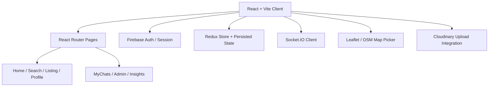
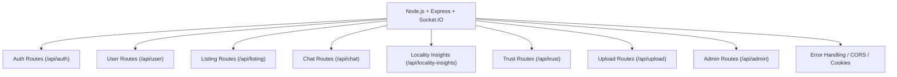
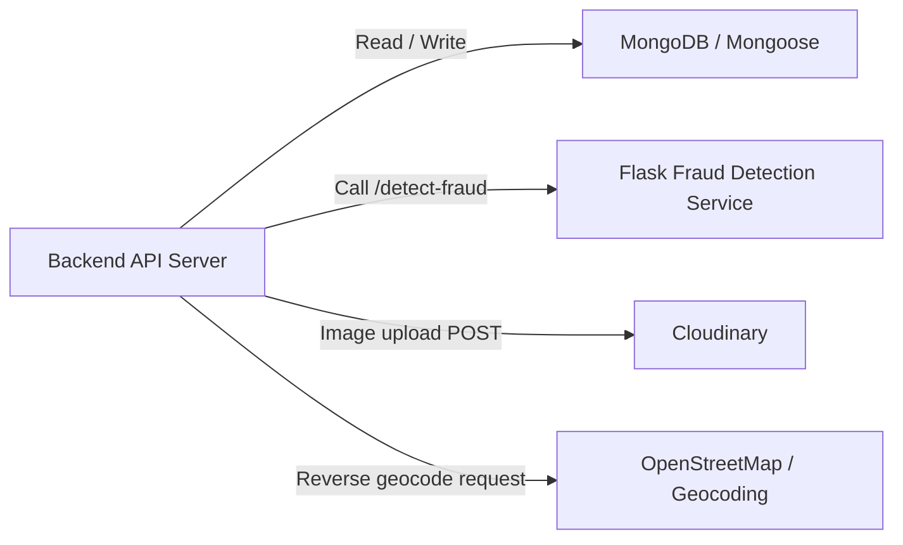

# Shelter Seeker System Architecture

## Overview
This diagram models the full Shelter Seeker application architecture, including both frontend and backend systems, plus the fraud detection microservice.

## Frontend Architecture

## Backend Architecture

## Data & Service Integration

## Architecture Notes

- **Frontend**: built with React and Vite, uses React Router for navigation, Redux for state management, Firebase for authentication, and Socket.IO client for real-time chat.
- **Backend**: Express server exposes REST endpoints, uses Socket.IO for chat events, and connects to MongoDB with Mongoose.
- **Realtime chat**: the backend keeps conversations in MongoDB and broadcasts chat messages and typing indicators using Socket.IO rooms.
- **Fraud detection**: a separate Flask microservice hosts the trained model and exposes `/detect-fraud` for listing validation.
- **Data flow**:
  1. User interacts with the React UI.
  2. Client sends API requests to the Node backend.
  3. Backend processes requests, reads/writes MongoDB, and returns JSON.
  4. Chat messages use websocket events for real-time delivery.
  5. Listing validation can call the Flask fraud service.
  6. Image upload requests are proxied to Cloudinary.

## How to use this model

- Open this file in VS Code and preview the Mermaid diagrams with a Mermaid preview extension.
- Use these smaller diagrams as separate images in your GitHub README.
- To export images, copy each Mermaid block into a Mermaid renderer or use a Mermaid CLI / live editor.
- Expand the model later with deployment details (e.g. Vite dev server, Node.js server, MongoDB Atlas, Flask service container).

## Architecture Notes

- **Frontend**: built with React and Vite, uses React Router for navigation, Redux for state management, Firebase for authentication, and Socket.IO client for real-time chat.
- **Backend**: Express server exposes REST endpoints, uses Socket.IO for chat events, and connects to MongoDB with Mongoose.
- **Realtime chat**: the backend keeps conversations in MongoDB and broadcasts chat messages and typing indicators using Socket.IO rooms.
- **Fraud detection**: a separate Flask microservice hosts the trained model and exposes `/detect-fraud` for listing validation.
- **Data flow**:
  1. User interacts with the React UI.
  2. Client sends API requests to the Node backend.
  3. Backend processes requests, reads/writes MongoDB, and returns JSON.
  4. Chat messages use websocket events for real-time delivery.
  5. Listing validation can call the Flask fraud service.
  6. Image upload requests are proxied to Cloudinary.

## How to use this model

- Open this file in VS Code and preview the Mermaid diagram with a Mermaid preview extension.
- Use the diagram as a blueprint to reproduce the architecture in Figma by creating blocks for each component and arrows for data flow.
- Expand the model later with deployment details (e.g. Vite dev server, Node.js server, MongoDB Atlas, Flask service container).
